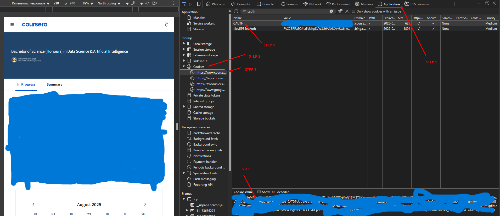

---

# 🚀 Coursera Course Downloader  
### *(Works with `cauth` token from your Chrome browser)*

This guide walks you through setting up and using the customized `coursera-dl` tool to download videos and materials from Coursera courses.

---

## 📋 Prerequisites

Before starting, ensure the following are installed:

- **Python**: Download from [python.org](https://www.python.org/downloads/).  
  ✅ *Make sure to check "Add Python to PATH" during installation.*

- **pip**: Comes pre-installed with Python 3.4+. If not, [install pip](https://pip.pypa.io/en/stable/installation/).

---
## 🖼️ Reference: Locating the `cauth` Token

Below is a screenshot to help you find the `cauth` token in Developer Tools:



---
## 🔑 How to Get Your `cauth` Token

1. **Log in** to your Coursera account at [coursera.org](https://www.coursera.org).

2. **Open Developer Tools**:
   - In Chrome: Press `Ctrl + Shift + I` (or `Cmd + Option + I` on Mac)  
   - Or right-click anywhere on the page → **Inspect**

3. Go to the **Application** tab → Expand **Cookies** → Select `https://www.coursera.org`.

4. Look for the cookie named `cauth`.

5. **Copy its Value** — this is your login token used for downloading.

---

## ⚙️ Installation

### 1. Create and activate a virtual environment:
```bash
mkdir courses_folder
cd courses_folder     # For Windows
```

### 2. Create and activate a virtual environment:
```bash
python -m venv myenv
.\myenv\Scripts\activate     # For Windows
```

### 3. Install the customized coursera-dl tool:
```bash
pip install git+https://github.com/visioncrunch/coursera-dl
```

---

## ⬇️ Downloading a Course

Use the following command to download a course:

```bash
coursera-dl --jobs 10 -ca "<your_cauth_string>" <course_name>
```

### 🔁 Replace:
- `<your_cauth_string>` → Your actual `cauth` token from browser cookies
- `<course_name>` → The course slug from the course URL

> **Example:**
> If the course URL is `https://www.coursera.org/learn/relational-database-management-systems`, the course name is:
> ```
> relational-database-management-systems
> ```

### ✅ Example Command:

```bash
coursera-dl --jobs 10 -ca "your_actual_cauth_here" relational-database-management-systems
```

> This will download the entire course to your current folder.

---

## ❓ Troubleshooting

- 🧠 Make sure your `cauth` string is **current** — re-copy it if downloads fail.
- 🔍 Double-check the course name — it must match the URL slug exactly.
- 🌐 Ensure your internet connection is stable.
- 🛡️ If a firewall or antivirus interferes, consider whitelisting the Python process.

---

## 📄 License

This tool is licensed under the **MIT License**. See the [LICENSE](LICENSE) file in the GitHub repo for more details.

---
